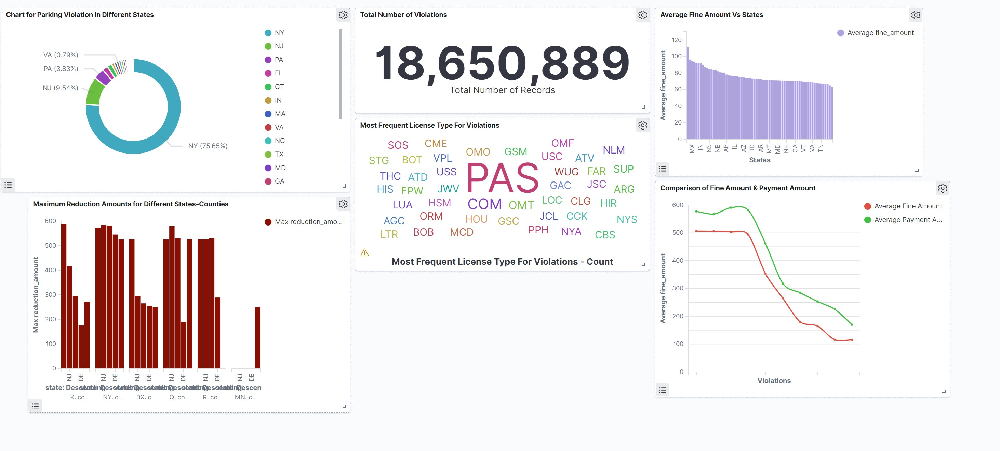

## Introduction

This project is a source of analyzing millions if Parking Violations by using few Big Data Technologies such as EC2, Docker, Elasticsearch and Kibana through the Amazon AWS portal from a real world dataset from NYC Open Data.

As part of the internal coding process, python scripting was used to connect data from Open Data API by creating an API Key. Then, after provisioning basic EC2 instance, the data was pushed to Elasticsearch cluster and was visualized through Kibana. I loaded more than 18 million data from the data source after using bulk API and analyzed that in Kibana portal. 


## Big Data Technologies

These Big Data Technologies were used for this project: Docker, Elasticsearch, Kibana, Python, AWS EC2, Terminal.


## Procedures

Step 1: Build the docker image 
```
docker build -t bigdata1:1.0 project01/
```
Step 2: Run the docker container 
```
docker run -v ${PWD}:/app -e DATASET_ID=“nc67-uf89” -e APP_TOKEN=“” -e ES_HOST=“” -e ES_USERNAME=“” -e ES_PASSWORD=“” bigdata1:1.0 --page_size=2 --num_pages=3
``` 
```--num_pages``` is marked as optional.


## Strategy

BULK API was used to load more than 18 million of data to make it efficient and cost effective.


## Visualization Through Kibana

* Chart-1: The Pie Chart indicates the percentage of the Violations in top 20 states.
* Chart-2: The brown colored bar chart indicates Maximum Reduction amount for different states.
* Chart-3: The numeric figure is showing the total number of rows.
* Chart-4: The informative categorical chart is explaining the most frequent license types for violations.
* Chart-5: The light purple bar chart tells us average fine amount for different states.
* Chart-6: The red and green line charts show the comparison berween fine amount and payment amount for different violations. 



## References

 - [BULK API](https://www.elastic.co/guide/en/elasticsearch/reference/current/docs-bulk.html)
 - [Open Camera and Parking Violations API](https://dev.socrata.com/foundry/data.cityofnewyork.us/nc67-uf89)
 - An [app token](https://data.cityofnewyork.us/profile/edit/developer_settings)  for the NYC Open Data API


